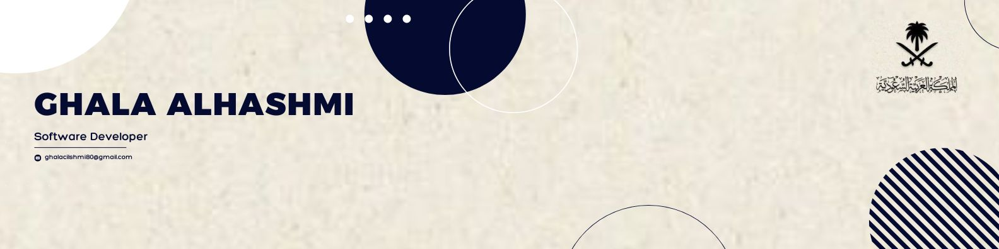

  

<h1 align="center">
  Ghala AlHashmi Alameer
</h1>

<h3 align="center">
  Software Engineer · Full-Stack Developer · Product Builder
</h3>

  I turn ideas into functional, scalable digital products.

  
  
  

 

<h2 align="center">About Me</h2>

  Software Engineer focused on building complete products from architecture and databases
  to backend systems, APIs, frontend interfaces, and deployment.

  I enjoy transforming real-world problems into structured, practical software solutions.

 

<h2 align="center">Tech Stack</h2>

  

 

<h2 align="center">What I Build</h2>

  Full-Stack Applications &nbsp;•&nbsp;
  Backend Systems & APIs &nbsp;•&nbsp;
  Database-Driven Platforms
   
  Real-Time Systems &nbsp;•&nbsp;
  Mobile Applications &nbsp;•&nbsp;
  Product Prototypes

 

<h2 align="center">Development Activity</h2>

  

 

<h2 align="center">GitHub Overview</h2>

  
  

  

 

<h2 align="center">Let's Connect</h2>

  Interested in building useful products, solving real-world problems,
  and collaborating on ambitious software projects.

  
  
  

 

  

